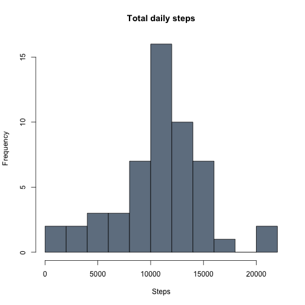
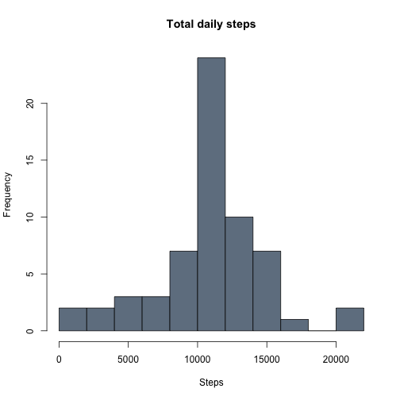
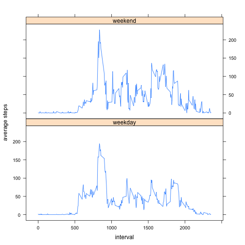

# Reproducible Research: Peer Assessment 1

## Loading and preprocessing the data

The dataset used for this study is the number of steps that an individual has taken each day, measured in 5 minute intervals, for two months.
The data is in CSV format - dates are converted into a datetime (YYYY-MM-DD) after the data is read in to R.


```r
fileName <- "activity.csv"
data <- read.csv(fileName)
data$date <- as.Date(data$date, "%Y-%m-%d")
```


## What is the mean total number of steps taken per day?

The loaded data is aggregated to get total steps for each day of the two month period.


```r
daily <- aggregate(data$steps, list(data$date), sum)
names(daily) <- c("date", "steps")
```


This is then plotted on a histogram to show the distribution of daily steps that the individual has taken.


```r
hist(daily$steps, breaks = 10, xlab = "Steps", main = "Total daily steps", col = "slategrey")
```

 


The mean and median number of daily steps can be calculated. NAs have been removed.


```r
mean(daily$steps, na.rm = TRUE)
```

```
## [1] 10766
```

```r
median(daily$steps, na.rm = TRUE)
```

```
## [1] 10765
```


## What is the average daily activity pattern?

The average number of steps taken at each 5 minute interval across each day of the study is calculated to show a typical pattern of activity.


```r
pattern <- aggregate(data$steps, list(data$interval), mean, na.rm = TRUE)
names(pattern) <- c("interval", "avgSteps")
```


This pattern is visualised using a line chart.


```r
plot(pattern$interval, pattern$avgSteps, type = "l", xlab = "interval", ylab = "average steps")
```

 


The interval with the highest average number of steps can be found.


```r
pattern$interval[pattern$avgSteps == max(pattern$avgSteps)]
```

```
## [1] 835
```


## Imputing missing values

Some days have missing values and no steps recorded. We can use the average pattern caclulated above to fill in these missing values and assume a "typical" day.

First, the number of records that have missing values are identified.


```r
missing <- data[is.na(data$steps), ]
nrow(missing)
```

```
## [1] 2304
```


These missing records are joined to the typical pattern dataset by interval to get an appropriate number of steps.
The replaced values are then appended to the original dataset (minus the missing values).


```r
dfSteps <- merge(missing, pattern, by = "interval")[, c(1, 3, 4)]
colnames(dfSteps)[3] <- "steps"
data2 <- rbind(data[!is.na(data$steps), ], dfSteps[, c("steps", "date", "interval")])
```


Now we're interested to see if the new dataset has a different distribution and/or mean and median.
As above, show the distribution of daily steps and calculate the mean and median.


```r
daily2 <- aggregate(data2$steps, list(data2$date), sum)
names(daily2) <- c("date", "steps")
hist(daily2$steps, breaks = 10, xlab = "Steps", main = "Total daily steps", 
    col = "slategrey")
```

 

```r
mean(daily2$steps)
```

```
## [1] 10766
```

```r
median(daily2$steps)
```

```
## [1] 10766
```


As you can see, the "typical" or "average" day that we substituted the missing records for yeilds the average number of steps per day across the two month period.
Therefore, the frequency of the 10000 band has increased for each of the days we replaced with a typical day's steps. Also, both the mean and median reflect the global mean number of steps.

## Are there differences in activity patterns between weekdays and weekends?

In order to determine whether there is a difference in activity between weekdays and weekends, the date of each measurement must be flagged as either being a weekday or weekend.
The weekdays() function is used to create a new column in our repaired dataset.


```r
data2$weekend <- ifelse(weekdays(data$date, TRUE) %in% c("Sat", "Sun"), "weekend", 
    "weekday")
```


A typical weekday and weekend were determined using the same method as earlier - taking an average across each day for every interval.


```r
weekend <- aggregate(data2$steps, c(list(data2$weekend), list(data2$interval)), 
    mean)
names(weekend) <- c("weekend", "interval", "avgSteps")
```


The lattice plotting system is used to visualise a typical weekday and weekend. There are no significant differences.


```r
library(lattice)
xyplot(avgSteps ~ interval | weekend, weekend, type = "l", layout = c(1, 2), 
    ylab = "average steps")
```

 

